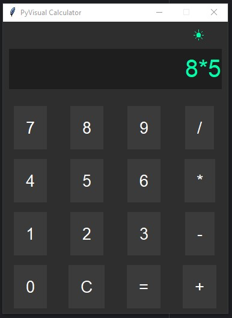
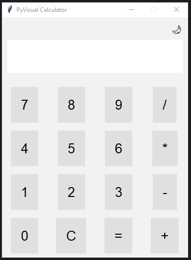
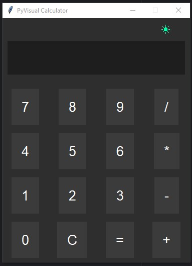

# PyVisual Calculator 🧮

A sleek and modern calculator built with **Python** and **Tkinter**, featuring a **dark/light theme toggle**. This simple yet visually appealing GUI application supports basic arithmetic operations and is perfect for learning Tkinter and GUI design in Python.

 

---

## ✨ Features

- 📱 **Modern UI** using `Tkinter`
- 🌙☀️ **Dark/Light Mode Toggle** with emoji icons
- ➕➖✖️➗ Basic arithmetic operations
- ⚠️ Graceful error handling for invalid expressions
- 🧠 Built with readability and theme customization in mind

---

## 📦 Installation

Make sure you have Python installed (version 3.6 or above recommended).

1. **Clone this repository**:
   ```bash
   git clone https://github.com/geekyscript/CalculatorGS.git
   cd pyvisual-calculator
   ```

2. **Run the calculator**:
   ```bash
   python calculator.py
   ```

---

## 🧾 Usage

- **Enter expressions** using the on-screen buttons.
- Press `=` to calculate the result.
- Press `C` to clear the current input.
- Click the **🌙 / ☀️ icon** in the top right to toggle between light and dark themes.

---

## 🛠️ Code Overview

- `themes` dictionary defines the dark and light themes.
- `apply_theme()` dynamically updates the UI components when themes are toggled.
- `click()` handles button events including calculation and clearing.
- Layout is created using a Tkinter grid system.

---

## 📁 Project Structure

```
pyvisual-calculator/
│
├── calculator.py       # Main application file
├── README.md           # Project documentation
└── screenshot.png      # UI preview (optional)
```

---

## 📸 Screenshots

### Light Theme 🌞
 <!-- Optional: add your screenshot -->

### Dark Theme 🌚
 <!-- Optional: add your screenshot -->

---

## 🧑‍💻 Author

**Your Name**  
[GitHub](https://github.com/geekyscript) | [LinkedIn](https://linkedin.com/in/geekyscript) | [Twitter](https://twitter.com/geekyscript)

---

## 📃 License

This project is licensed under the [MIT License](LICENSE).

---

## 🙌 Contributing

Contributions are welcome! Feel free to:
- Submit pull requests
- Report bugs or request features via [Issues](https://github.com/your-username/pyvisual-calculator/issues)

---

## ⭐️ Show your support

If you like this project, consider giving it a ⭐️ on GitHub!
